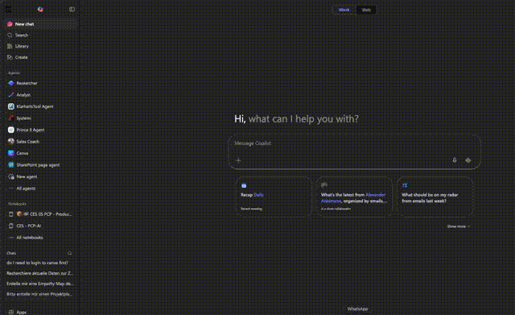

<div align="center">

# Classic Waffle

**The world moves on. New UIs ship, familiar buttons disappear, and muscle memory goes to waste. But sometimes it's worth — and just plain fun — to bring a classic back.**

Classic Waffle puts the beloved Microsoft 365 app launcher right where it belongs: one click away, floating over the page, just like the good old days.



[](LICENSE)
[]()
[]()
[]()

</div>

---

## Why?

Microsoft replaced the classic waffle menu with a new navigation experience. If you're someone who opened that 3x3 grid dozens of times a day to jump between Outlook, Teams, SharePoint, and the rest — you know the feeling. That quick, reliable launcher was part of the workflow.

Classic Waffle brings it back as a browser extension. It injects the familiar grid icon right into the M365 navigation bar, and opens a floating app launcher on click. No new tabs, no hunting through menus. Just your apps, one click away.

## Features

- **In-page waffle menu** — The classic floating app grid, injected directly into M365 pages next to the Copilot icon
- **Side panel mode** — Also available as a browser side panel via the toolbar icon
- **35 M365 apps** — Outlook, Teams, Word, Excel, PowerPoint, OneDrive, SharePoint, Power BI, and many more
- **Drag and drop** — Reorder apps by dragging tiles in the grid or in settings
- **Show/hide apps** — Toggle visibility of individual apps you don't need
- **Custom groups** — Rename default groups, create your own, or switch to a flat ungrouped view
- **Dark mode** — Automatically matches your system theme
- **Settings sync** — Your configuration follows you across devices via Chrome/Edge sync
- **Lightweight** — No frameworks, no build step, no dependencies. Under 1 MB total

## Installation

### From source (developer mode)

1. Clone this repository:
   ```bash
   git clone https://github.com/thomyg/ClassicWaffel.git
   ```
2. Open your browser's extension page:
   - **Chrome**: `chrome://extensions`
   - **Edge**: `edge://extensions`
3. Enable **Developer mode** (toggle in the top-right corner)
4. Click **Load unpacked** and select the `ClassicWaffel` folder
5. Navigate to any M365 page — the waffle icon appears in the top nav

### From the Chrome Web Store / Edge Add-ons

_Coming soon._

## Usage

**On M365 pages:**
- The waffle icon appears in the top navigation bar, next to the Copilot icon
- Click it to open the floating app launcher
- Click any app to open it in a new tab
- Click outside the panel to close it

**Side panel (any page):**
- Click the Classic Waffle icon in your browser toolbar to open the side panel
- Same app grid, always accessible

**Settings (via side panel):**
- Click the gear icon to configure
- Toggle app visibility with switches
- Drag to reorder apps
- Enable/disable grouped view
- Rename or create custom groups
- Reset everything to defaults

## Included Apps

| Category | Apps |
|----------|------|
| Productivity | Outlook, Teams, Word, Excel, PowerPoint, OneNote, OneDrive, SharePoint |
| Collaboration | Viva Engage, Stream, Whiteboard, Loop, Clipchamp, Sway |
| Business Apps | Power BI, Power Apps, Power Automate, Power Pages, Dynamics 365 |
| Planning & Tasks | To Do, Planner, Lists, Forms, Bookings, Calendar, People |
| IT & Admin | Admin, Compliance, Security, Entra, Intune |
| Other | Copilot, Designer, Microsoft 365, Delve |

## Tech Stack

| | |
|---|---|
| **Architecture** | Chrome Extension Manifest V3 |
| **Language** | Vanilla JavaScript (ES Modules) — no frameworks, no build step |
| **Styling** | CSS Grid, CSS Custom Properties, Shadow DOM (for in-page isolation) |
| **Interaction** | HTML5 Drag and Drop API |
| **Storage** | `chrome.storage.sync` for cross-device persistence |
| **Injection** | Content scripts + `chrome.scripting` API for M365 page integration |

## Project Structure

```
ClassicWaffel/
├── manifest.json          # Extension manifest (V3)
├── background.js          # Service worker — side panel + content script injection
├── content.js             # Injected into M365 pages — waffle icon + floating panel
├── content.css            # Minimal host styles for injected element
├── sidepanel.html         # Side panel shell
├── sidepanel.js           # Side panel entry point
├── js/
│   ├── apps.js            # App registry (35 M365 apps)
│   ├── storage.js         # Settings persistence + migration
│   ├── renderer.js        # Grid rendering (flat + grouped)
│   ├── dragdrop.js        # Drag-and-drop reordering
│   └── settings.js        # Settings view controller
├── css/
│   ├── sidepanel.css      # Side panel styles
│   └── settings.css       # Settings view styles
├── icons/
│   ├── apps/              # M365 app icons (SVG, ~35 files)
│   └── extension/         # Toolbar icons (PNG, 16–128px)
├── LICENSE
└── README.md
```

## Contributing

Contributions are welcome! Whether it's a missing app, a better icon, a UX improvement, or a bug fix — open an issue or submit a PR.

1. Fork the repo
2. Create a feature branch (`git checkout -b feature/my-feature`)
3. Commit your changes
4. Push and open a Pull Request

## Trademark Notice

Microsoft 365, Outlook, Teams, Word, Excel, PowerPoint, OneNote, OneDrive, SharePoint, and other Microsoft product names are trademarks of Microsoft Corporation. This extension is not affiliated with, endorsed by, or sponsored by Microsoft. App icons are simplified representations used for identification purposes only.

## License

[MIT](LICENSE) — do whatever you want with it.
